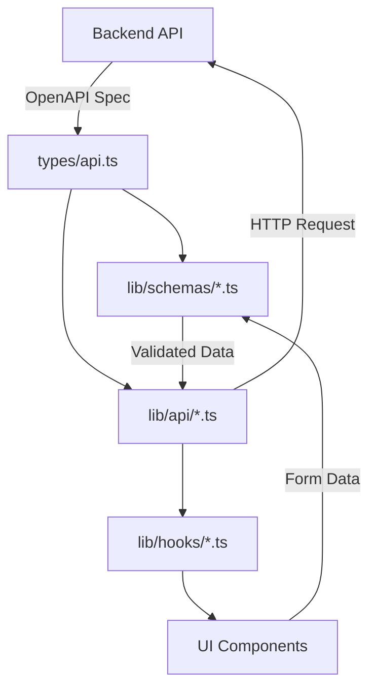

# Frontend Architecture

This document describes the high-level architecture of the `taiwanstay-front` application.

## Layers

The application follows a strict layered architecture to ensure separation of concerns and maintainability.

### 1. Types Layer (`/types`)
- **Source of Truth**: `types/api.ts` is auto-generated from the Backend OpenAPI specification (`swag init`).
- **Purpose**: Defines the shape of data returned by the API (`domain.*` types).
- **Rule**: Do not manually modify `api.ts`.

### 2. Schema Layer (`/lib/schemas`)
- **Tool**: `zod`
- **Purpose**: Runtime validation for forms and API responses.
- **Alignment**: Schemas must strictly align with the structures in `types/api.ts`.
- **Key Files**:
    - `user.ts` -> `domain.User`
    - `opportunity.ts` -> `domain.Opportunity`
    - `host.ts` -> `domain.Host`
    - `profile.ts` -> `domain.Profile`
    - `application.ts` -> `domain.Application`

### 3. Service Layer (`/lib/api`)
- **Purpose**: Pure TypeScript functions to communicate with the Backend API.
- **Client**: Uses `lib/api.ts` (the unified axios client with NextAuth support).
- **Return Types**: strictly typed Promises returning `domain.*` objects.
- **Key Files**:
    - `user.ts`: User profile fetching (public/me).
    - `opportunity.ts`: Opportunity CRUD.
    - `host.ts`: Host management.
    - `application.ts`: Application submission.

### 4. Data Fetching Layer (`/hooks`)
- **Tool**: `@tanstack/react-query` (v5)
- **Purpose**: Manages server state (caching, revalidation, loading states) in Client Components.
- **Usage**: Hooks should call functions from the **Service Layer**, NOT `fetch` directly.
- **Example**: `useOpportunities` calls `getOpportunities()` from `lib/api/opportunity.ts`.

### 5. UI Layer (`/app`, `/components`)
- **Tool**: Next.js App Router, Tailwind CSS, Shadcn UI.
- **Purpose**: Rendering views.
- **Rule**: UI components should receive data via Hooks (Client Components) or directly from Service Layer (Server Components).

## Data Flow

## Best Practices

1. **Strict Typing**: Always use types from `@/types/api` for API data.
2. **No Direct Fetch in UI**: Always use a Hook or Service.
3. **Validation**: Validate forms using `zod` schemas before sending to Service.
4. **Vertical Slices**: When adding a feature, implement it bottom-up: Type -> Service -> Hook -> UI.

## Workflow: How to Implement a Feature

To ensure consistency, follow this 5-step process when adding new functionality:

1.  **Check Backend Types (`types/api.ts`)**:
    *   Confirm the backend exposes the necessary `domain.*` structs.
    *   If missing, coordinate with backend to regenerate Swagger docs.

2.  **Define validation (`lib/schemas/`)**:
    *   Create or update a `.ts` file in `lib/schemas`.
    *   Define Zod schemas that mirror the backend `domain` types.
    *   Export `FormData` types inferred from the schema.

3.  **Create Service (`lib/api/`)**:
    *   Implement pure functions using `http` client.
    *   Functions must return typed promises (e.g., `Promise<domain.Opportunity>`).
    *   Avoid logic here; just map endpoints to functions.

4.  **Create Hooks (`lib/hooks/`)**:
    *   Create a `use[Feature].ts` file.
    *   Implement `useQuery` for GET requests (Read).
    *   Implement `useMutation` for POST/PUT/DELETE requests (Write).
    *   Handle `queryClient.invalidateQueries` in `onSuccess`.

5.  **Build UI (`app/` & `components/`)**:
    *   **Pages**: `app/[feature]/page.tsx` for routing and data gathering.
    *   **Components**: `components/[feature]/` for domain-specific UI (e.g., Cards, Modals).
    *   **Generic UI**: `components/ui/` for Shadcn primitives (Buttons, Inputs).

## Form Handling Strategy

We standardize on **React Hook Form** combined with **Zod Resolver**.

*   **Setup**: Use `useForm<SchemaType>({ resolver: zodResolver(schema) })`.
*   **Components**: Use `FormField`, `FormItem`, `FormControl` from `components/ui/form` for accessible, validated inputs.
*   **Validation**: All validation logic lives in the Zod schema, NOT in the UI component.

## State Management

We use **TanStack Query (React Query)** for server state.

*   **Query Keys**: Define string constants at the top of hook files (e.g., `const QUERY_KEY = 'opportunities'`).
*   **Invalidation**: Always invalidate the relevant query key after a successful mutation to ensure UI freshness (e.g., Refetching list after creation).

## Asset Delivery Strategy

We use a dual-strategy for serving images to optimize performance and security:

1.  **Public Images (CDN)**:
    *   **Context**: Profile pictures, published Opportunities.
    *   **Mechanism**: Served directly via **ImageKit** (or public GCS bucket) CDN URLs.
    *   **Usage**: Standard `` tags.

2.  **Private Images (Signed URLs)**:
    *   **Context**: Pending moderation images, rejected images (Admin/Host view only).
    *   **Mechanism**:
        1.  Frontend requests image access via API (e.g., `GET /admin/images/pending`).
        2.  Backend generates a **GCS V4 Signed URL** (valid for short duration, e.g., 15-60 mins).
        3.  Backend returns the Signed URL in the JSON response.
        4.  Frontend renders the Signed URL directly in ``.
    *   **Benefit**: Offloads bandwidth to GCS directly, avoiding backend proxying costs and latency.

## UX & Error Handling Strategy

### 1. Loading States (Skeletons)
We prioritize perceived performance by avoiding generic full-page spinners where possible.
-   **Pattern**: Use "Skeleton Screens" that mimic the layout of the content being loaded.
-   **Location**: `components/skeletons/` (e.g., `ApplicationCardSkeleton.tsx`, `OpportunityCardSkeleton.tsx`).
-   **Usage**: Render skeletons during the `isLoading` state of React Query hooks.

### 2. Error Handling (Boundaries)
We implement a defensive programming strategy to prevent the entire app from crashing due to a single component error.
-   **Global Boundary**: `components/common/ErrorBoundary.tsx` wraps the main `DashboardLayout`.
-   **Behavior**: Catches runtime errors in the component tree and displays a friendly "Something went wrong" UI with a "Refresh" button.
-   **Granularity**: Can be applied to specific widgets or sections that are prone to failure (e.g., Maps, complex lists) to isolate faults.

