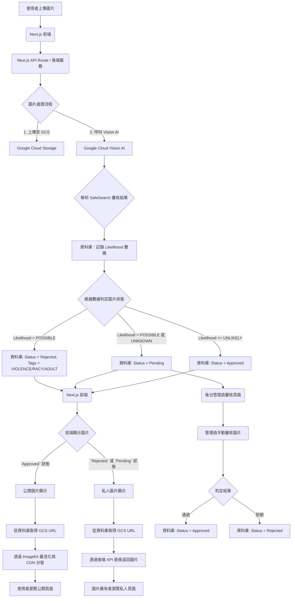

  圖片管理系統遷移計畫

  1. 概述

  為了提升系統的穩定性、可控性並降低長期成本，我們將對現有的圖片管理功能進行重構。舊有依賴 Cloudinary 的方案將被一套全新的、以 Google
  Cloud Storage (GCS) 為核心的自託管流程所取代。

  2. 新架構流程圖

  新架構整合了 GCS 進行原始檔案儲存，透過 Google Vision AI 進行自動化內容審核，並利用 ImageKit 提供 CDN 加速與圖片最佳化。

修改計畫

  以下是需要修改的檔案列表以及具體的修改規劃：

  1. 上傳邏輯 (核心替換)

  這些檔案負責處理圖片的上傳流程。我們需要將 CloudinaryUploadService 的邏輯替換為呼叫我們新的後端 API (/api/images/upload)。

   * `components/common/CloudinaryUploadWidget.tsx`:
       * 修改: 這是主要的上傳 UI 元件。需要將 CloudinaryUploadService.uploadFile 的呼叫，改為 fetch 或 axios 來呼叫我們新的後端 API。
       * 目標: 將檔案傳送到後端，後端會回傳 GCS 的 URL 和審核狀態。
   * `components/application/steps/PhotoUploadStep.tsx`:
       * 修改: 與上面類似，修改上傳和刪除邏輯。
   * `components/host/opportunities/tabs/MediaUploadTab.tsx`:
       * 修改: 同上，修改上傳和刪除邏輯。
   * `lib/cloudinary/uploadService.ts`:
       * 動作: (可選) 逐步廢棄。我們可以先建立一個新的 ImageUploadService，然後讓上述元件改用新的
         Service。舊檔案可以暫時保留以便參考，最後再刪除。

  2. 圖片顯示 (改為 ImageKit)

  這些是顯示圖片的 UI 元件。我們需要修改它，讓它不再請求私有簽名 URL，而是直接使用 ImageKit 的 URL 來顯示圖片。

   * `components/CloudinaryImage.tsx`:
       * 修改: 這是最核心的顯示元件。需要將內部邏輯（特別是 getSignedUrls 和 getOptimizedImageUrl）完全替換。
       * 新邏輯:
           1. 接收一個圖片物件 (包含 GCS URL 和審核狀態)。
           2. 如果圖片狀態是 Approved，則組合出 ImageKit 的 URL
              (https://ik.imagekit.io/your_instance/gcs_bucket_path/image.jpg?tr=...)。
           3. 如果狀態是 Pending 或 Rejected，則呼叫後端 API (/api/images/private/[imageId]) 來取得圖片，以保護隱私。
           4. 元件可以改名為 ManagedImage.tsx 或類似的名稱。
   * 所有匯入 `CloudinaryImage` 的檔案:
       * 影響: pages/admin/hosts/[hostId].tsx, components/opportunities/OpportunityList.tsx,
         components/opportunity/OpportunityMedia.tsx 等等。
       * 修改: 傳遞給新元件的 props 需要更新為新的圖片物件格式。

  3. 後端 API 與類型定義 (移除與重構)

  這些是後端和共用的部分，需要被新的架構取代。

   * `pages/api/cloudinary/` (整個目錄):**
       * 動作: 完全刪除。sign-url.ts, delete.ts, notification.ts 都將被新的 API 取代。
   * `lib/cloudinary.ts`, `lib/cloudinary/config.ts`, `lib/cloudinary/utils.ts`:
       * 動作: 完全刪除。這些輔助函式和設定檔將不再需要。
   * `lib/cloudinary/types.ts` 和 `lib/schemas/application.ts` (部分):
       * 修改: CloudinaryImageResource 這個類型定義需要被一個新的 ImageResource 類型取代。新的類型將包含 gcsUrl, status, tags
         等欄位，以符合新流程的資料庫結構。
   * `package.json`:
       * 修改: 移除 "cloudinary" 和 "next-cloudinary" 這兩個依賴。

  ---

  建議的執行步驟

   1. 建立新的 API 端點: 在 pages/api/images/ 下建立 upload.ts 和 private/[id].ts 的基本結構。
   2. 修改上傳元件: 從 CloudinaryUploadWidget.tsx 開始，將其上傳邏輯指向新的 upload.ts 端點。
   3. 重構顯示元件: 複製 CloudinaryImage.tsx 為 ManagedImage.tsx，並開始修改其內部邏輯以適應 ImageKit 和私有圖片顯示。
   4. 替換類型定義: 定義新的 ImageResource 類型，並逐步替換掉專案中所有使用 CloudinaryImageResource 的地方。
   5. 清理: 在所有功能都遷移完成後，刪除所有 lib/cloudinary 和 pages/api/cloudinary 的檔案，並從 package.json 中移除依賴。