# TaiwanStay Frontend Design Plan & Uizard Prompts

本文件規劃了 TaiwanStay 前端頁面流程，並提供用於 Uizard AI 生成 UI 的詳細提示詞 (Prompts)。

## 1. Sitemap & User Flow

```mermaid
graph TD
    Home["首頁 (Landing)"] --> Login["登入"]
    Home --> Register["註冊"]
    Home --> OppList["工作機會列表"]

    Login --> Dashboard["使用者儀表板"]

    OppList --> OppDetail["機會詳情"]
    OppDetail --> Apply["申請表單"]

    Dashboard --> MyProfile["個人資料"]
    Dashboard --> MyApps["我的申請"]
    Dashboard --> MyBookmarks["我的收藏"]

    subgraph Host ["主人專區"]
        Dashboard --> HostDashboard["主人儀表板"]
        HostDashboard --> ManageOpps["管理機會"]
        ManageOpps --> EditOpp["編輯機會"]
        ManageOpps --> CreateOpp["建立機會"]
        HostDashboard --> HostApps["收到的申請"]
    end

    subgraph Admin ["管理員專區"]
        Dashboard --> AdminDashboard["管理員儀表板"]
        AdminDashboard --> AdminUsers["會員管理"]
        AdminDashboard --> AdminOpps["機會管理"]
        AdminDashboard --> AdminImages["圖片審核"]
    end
```



## 2. Uizard AI Prompts (畫面生成提示)

請使用以下提示詞輸入 Uizard AI (Autodesigner) 來生成對應頁面。

### 🎨 通用風格設定 (Style Guide)
> **Style Prompt:**
> "Vibrant, tropical, and energetic aesthetic inspired by Southern Taiwan. Primary color: Ocean Blue (#006994) or Turquoise. Secondary color: Sunny Yellow (#FFD700) and Sandy Beige. Typography: Modern Sans-serif (Inter or Roboto). High-quality imagery of beaches, surfing, diving, and mountains. Card-based layout with soft shadows. Rounded corners."

---

### 📄 Page 1: 首頁 (Landing Page)
**對應 User Story:** 2.1, 2.2
**Prompt:**
```text
A stunning landing page for "TaiwanStay", a platform for rural working holidays in Taiwan.
Header: Logo on left, Navigation (Opportunities, About, Login, Sign Up) on right.
Hero Section: Full-width background image of a stunning beach in Kenting or a coastal road with mountains in the background. Large title "Experience Real Taiwan", subtitle "Exchange your skills for accommodation and meals in sunny Southern Taiwan". Search bar in the center with fields for "Keyword", "Location", and "Date".
Featured Opportunities: A grid of 3-4 cards showing top-rated opportunities. Each card has an image, title, location tag, and "Apply Now" button.
How It Works: 3-step icon section (Find, Apply, Go).
Testimonials: Carousel of user reviews.
Footer: Links to social media, contact, privacy policy.
```

### 📄 Page 2: 工作機會列表 (Opportunity Listings)
**對應 User Story:** 2.1, 2.2
**Prompt:**
```text
A search results page for working holiday opportunities in Southern Taiwan.
Sidebar (Left): Filters for "Location" (Kenting, Hengchun, Taitung, Xiaoliuqiu, Green Island), "Type" (Scuba Diving, Freediving, Surf Hostel, Minsu/Homestay), "Proximity to Beach", and "Availability".
Main Content (Right): A list of opportunity cards. Each card displays a cover image (underwater shot or cozy minsu), title (e.g., "PADI Dive Center Assistant" or "Cozy Minsu Helper"), host name, location, short description, and tags (e.g., "Free Diving Course", "Ocean View", "License Required").
Top Bar: "Sort by" dropdown (Newest, Popular) and toggle for Map View/List View.
Pagination at the bottom.
```

### 📄 Page 3: 機會詳情頁 (Opportunity Detail)
**對應 User Story:** 2.3, 3.1, 5.1
**Prompt:**
```text
A detailed page for a specific volunteering opportunity in Southern Taiwan (e.g., a Dive Shop or Minsu).
Hero: Large cover image gallery showing underwater scenes, diving gear, or a welcoming Minsu common area.
Title Section: Title (e.g., "Freediving Center Helper"), Host Name (with avatar), Location (e.g., "Xiaoliuqiu"), and "Bookmark" icon button.
Main Content (Left Column):
- "About the Opportunity": Text description mentioning the dive shop culture or minsu atmosphere.
- "What you'll do": Bullet points of tasks (e.g., "Tank filling", "Gear washing", "Guest check-in", "Housekeeping").
- "What you get": Icons for Accommodation, Meals, "Open Water Course", "Fun Dives", etc.
- "Requirements": Age, Language, Swimming skills.
Sidebar (Right Column - Sticky):
- "Apply Now" primary button.
- Host Profile Summary: Small bio, rating stars, "Contact Host" button.
- Map showing location near the coast.
- Availability Calendar widget.
```

### 📄 Page 4: 使用者儀表板 (User Dashboard)
**對應 User Story:** 1.2, 3.2, 5.2
**Prompt:**
```text
A personal dashboard for a logged-in user.
Sidebar (Left): Navigation (Overview, My Applications, Saved Opportunities, Profile, Settings).
Main Area:
- Welcome message "Hello, [Name]".
- Stats Cards: "Applications Sent", "Accepted", "Saved Items".
- "Recent Applications" Table: Columns for Opportunity Name, Date Applied, Status (Pending/Accepted/Rejected), and Action button.
- "Saved Opportunities": Horizontal scroll list of bookmarked cards.
```

### 📄 Page 5: 主人儀表板 - 管理機會 (Host - Manage Opportunities)
**對應 User Story:** 4.1, 4.2, 4.3
**Prompt:**
```text
A management dashboard for Hosts to manage their listings.
Header: "My Opportunities" with a "+ Create New Opportunity" button on the top right.
List: A table or list view of created opportunities.
Each row shows: Thumbnail (e.g., diving gear or hostel room), Title (e.g., "Diving Assistant Needed"), Status (Active/Draft/Closed), Views count, Applications count.
Actions: "Edit" (Pencil icon), "View" (Eye icon), "Delete/Close" (Trash icon).
Tabs: Active, Drafts, Archived.
```

### 📄 Page 6: 主人儀表板 - 收到申請 (Host - Received Applications)
**對應 User Story:** 3.3, 3.4
**Prompt:**
```text
A dashboard page for Hosts to review incoming applications.
Kanban Board Layout or List View.
Columns/Tabs: "Pending Review", "Shortlisted", "Accepted", "Rejected".
Application Card: Applicant Name, Avatar, Age, Nationality, Applied Date.
Clicking a card opens a modal or side panel with:
- Applicant's full profile and cover letter.
- Action buttons: "Accept", "Reject", "Message".
```

### 📄 Page 7: 建立/編輯機會表單 (Create/Edit Opportunity)
**對應 User Story:** 4.1, 4.2
**Prompt:**
```text
A multi-step form wizard for creating a new opportunity.
Progress Bar at top: Basic Info -> Details -> Requirements -> Location -> Media.
Step 1 (Basic Info): Title input, Type dropdown (Scuba Diving, Freediving, Minsu, Surf Hostel, etc.), Short Description.
Step 2 (Details): Rich text editor for Description, Checkboxes for Benefits (Accommodation, Meals, Diving Courses, Fun Dives).
Step 3 (Media): Drag-and-drop area for uploading photos (e.g., "Upload photos of your hostel or farm").
Bottom Navigation: "Back" and "Next" buttons.
```

### 📄 Page 8: 管理員後台 (Admin Dashboard)
**對應 User Story:** 6.1, 6.2, 6.4, 6.5
**Prompt:**
```text
A professional admin dashboard for platform management.
Sidebar: Dashboard, Users, Opportunities, Image Moderation, Reports.
"Image Moderation" Page:
- Grid of uploaded images pending review.
- Each image has "Approve" (Check) and "Reject" (X) overlay buttons.
- Batch action toolbar at the top.
"Users" Page:
- Data table of all users.
- Columns: Name, Email, Role (User/Host/Admin), Status (Active/Banned).
- Actions: "Edit", "Ban/Unban".
```
